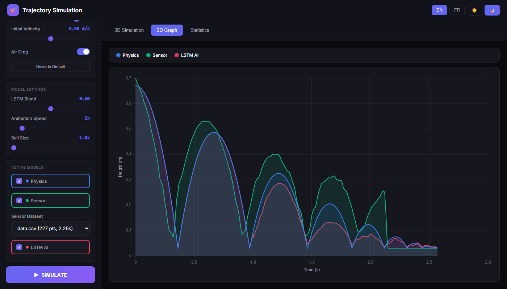
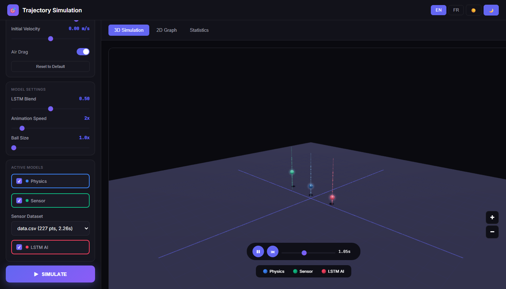
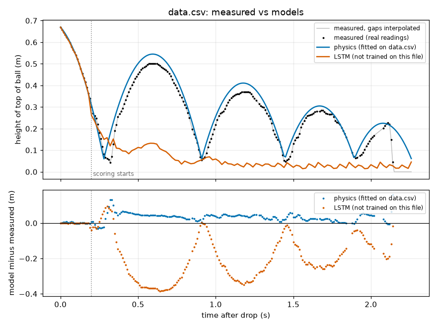
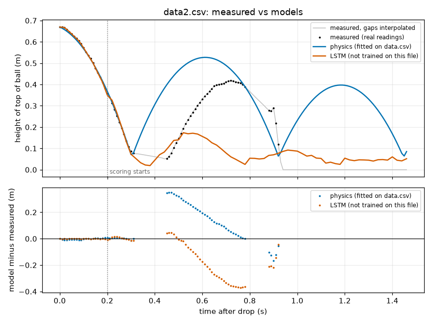

# Ball Trajectory Prediction

I built a small web app that drops a virtual ball three times at once, using three different ways of knowing where the ball will go: a physics simulation, a real sensor recording, and a neural network. All three are rendered side by side in 3D so you can see where they agree and where they don't.

This started as a physics project (the `PEN` folder it lives in) about bouncing balls and energy loss on impact. I had real data from an ultrasonic sensor recording a ball falling and bouncing, and I wanted to compare that to what a textbook physics model predicts, and to what a machine learning model would predict if it only saw the shape of the curve.





## What it does

You pick a ball (steel, rubber, ping-pong, tennis, or custom mass/size) and a drop height, and the app simulates the fall with three models simultaneously:

- Physics (blue ball): a numerical integration of Newton's second law with air drag and a bouncing model.
- Sensor (green ball): real measurements I recorded with an ultrasonic distance sensor, replayed and rescaled to the chosen height.
- LSTM (red ball): a recurrent neural network trained on a mix of simulated and real trajectories, predicting the next positions from the recent past.

The three balls drop together in a Three.js 3D scene, there's a 2D height-vs-time chart (Chart.js) to compare curves precisely, and a stats panel with fall time, max velocity, and bounce count. The interface has an English/French toggle and a light/dark theme, both of which I added mostly because I was switching between languages while writing the report.

## How it works

### Physics model

The physics engine (`physics.py`) treats the ball as a point mass under gravity and quadratic air drag, integrated with **velocity Verlet** rather than simple Euler steps, because Verlet conserves energy much better over many bounces:

$$\vec{a} = \vec{g} - \frac{\rho C_d A}{2m}\,|\vec{v}|\,\vec{v}$$

$$\vec{r}(t+\Delta t) = \vec{r}(t) + \vec{v}(t)\Delta t + \tfrac{1}{2}\vec{a}(t)\Delta t^2, \qquad \vec{v}(t+\Delta t) = \vec{v}(t) + \tfrac{\vec{a}(t)+\vec{a}(t+\Delta t)}{2}\Delta t$$

with $\rho = 1.25\ \text{kg/m}^3$ for air density and $C_d = 0.47$ for a sphere. Because the drag depends on velocity, the acceleration at the end of the step is computed from a forward-Euler estimate of the end-of-step velocity. Each ball preset (steel, rubber, ping-pong, tennis) has its own mass, radius and coefficient of restitution $e$, taken from real measurements where I had them (the rubber ball preset uses 59 g and matches `data.csv`).

When the ball hits the ground, its velocity flips and shrinks by $e$. From energy conservation ($mgh = \tfrac12 mv^2$), the rebound height after bounce $n$ follows a geometric sequence:

$$e = \sqrt{\dfrac{h_{n+1}}{h_n}} \qquad\Rightarrow\qquad h_n = e^{2n} h_0$$

which is why the peaks of a bouncing-ball chart decay along an exponential envelope, not linearly. The square comes from the fact that $e$ is a ratio of velocities while $h$ measures energy, and kinetic energy scales as $v^2$. In the code I also decay the restitution itself a little on every bounce, $e_\text{eff} = e \cdot 0.95^n$ (the 0.95 is a parameter, `restitution_decay`), to model the ball losing more energy as it deforms repeatedly. A pure constant-$e$ model bounces for too long compared to what I actually recorded.

### Sensor data

The sensor readings (`data.csv`, `data2.csv`, `data3.csv`) are two-column CSVs: time in milliseconds and the distance from the sensor (mounted 70 cm above the floor) to the top of the ball, sampled roughly every 8-10 ms. `data_processing.py` cleans this up: readings above 66 cm mean the sensor lost the ball (it clamps a long trailing run of these to "ball at rest," and linearly interpolates isolated glitches), then converts distance to height ($h = H_\text{sensor} - d$), applies a Savitzky-Golay smoothing filter, and resamples to a uniform 10 ms grid so it can be compared against the other two models on the same time axis.

### LSTM model

The network (`model.py`) is a small recurrent model built with Keras: a bidirectional LSTM (128 units) followed by dropout, a second unidirectional LSTM (64 units), dropout again, a dense layer (64, ReLU), and a final dense layer outputting 10 future (time, height) pairs. It takes the last 50 timesteps of normalized time, height, and velocity as input and predicts the next 10 steps, which get fed back in autoregressively to build a full trajectory.

Real recordings alone aren't enough data to train a network, so `synthetic.py` generates several hundred additional trajectories by running a simplified copy of the physics engine with randomized mass, radius, drag and restitution, mixed in with augmented copies of the real recordings (20 per file: a little noise on the height and a random height scaling). By default that is 800 trajectories, and each one is cut into 4 random windows of 50 input steps and 10 target steps at 20 ms, so about 3200 training windows. The windows can start anywhere along the fall, including after the ball has come to rest, because at prediction time the network is run forward over the whole trajectory. Training uses Adam with gradient clipping, mean squared error loss, and early stopping on a validation split.

Because the network only ever sees Earth-like gravity and everyday ball masses during training, it can behave oddly if you push the physics sliders to extreme values it never saw in training: it's approximating a pattern, not solving the equations.

## What I found

Fitting the restitution coefficients to the recorded data (rather than using idealized textbook values) mattered a lot: a constant, high restitution made the ball bounce for much longer than the real one did, and a small extra decay per bounce was needed to match how quickly it died out. The numbers for how well each model matches the recordings are in the Results section below. The short version is that the physics model matches `data.csv` well, transfers badly to my other two recordings, and the LSTM does not reproduce the bouncing at all. Where physics and sensor diverge is mostly right at each impact, since the sensor's sampling rate can miss the exact instant of the bounce and smooths the peak slightly.

## Results

`python evaluate.py` compares the physics model and the LSTM with my three recordings. It writes the table in [`docs/results.md`](docs/results.md), the cross-fit table in `docs/physics_cross_fit.csv` and the plots in `docs/figures/`. I ran it once, and everything below is what it printed.

How the comparison works:

- The measured curve is the height of the top of the ball from `data_processing.py`, in metres. I only score samples that sit next to a real sensor reading. The sensor often loses the ball and the cleaning step fills those gaps by interpolation, and scoring a model against my own interpolation would be meaningless. That leaves 183, 51 and 108 scored points for `data.csv`, `data2.csv` and `data3.csv`. Scoring starts at 0.2 s.
- The sensor cannot see closer than about 3 cm, so the ball is already moving at the first reading. I estimate that starting speed for each file from its first 0.2 s (about 0.83, 0.53 and 0.45 m/s). The physics model gets that speed and the drop height, nothing else.
- Physics: the rubber preset (59 g, 3 cm radius, which I assume for all three files) with only the restitution and the per-bounce decay fitted, by grid search for the lowest RMSE on `data.csv`. The result is a restitution of 0.87 and a decay of 0.98. Those two numbers are then used unchanged on `data2.csv` and `data3.csv`, so those two rows are held-out results and the `data.csv` row is in-sample.
- LSTM: for each file I train a new network on the synthetic trajectories plus augmented copies of the other two recordings only, give it the first 0.2 s of the measured fall, and let it continue on its own predictions. It never saw the file it is scored on. The `model.keras` that the app saves is trained on all three files, so I did not use it for any number here.
- The "constant" row predicts the average measured height of that file. It uses information neither model has and only shows what an uninformative answer scores.

Errors are model minus measured. The apex columns refer to the first rebound peak (searched between 0.35 s and 1.0 s).

| Dataset | Model | RMSE (m) | MAE (m) | First apex time (s) | First apex height (m) |
|---|---|---|---|---|---|
| data.csv | physics (fitted here) | 0.042 | 0.036 | -0.030 | +0.044 |
| data.csv | LSTM (held out) | 0.234 | 0.204 | -0.040 | -0.368 |
| data.csv | constant | 0.128 | 0.105 | -0.270 | -0.242 |
| data2.csv | physics (held out) | 0.176 | 0.131 | -0.110 | +0.109 |
| data2.csv | LSTM (held out) | 0.202 | 0.149 | -0.200 | -0.245 |
| data2.csv | constant | 0.116 | 0.100 | -0.370 | -0.144 |
| data3.csv | physics (held out) | 0.162 | 0.127 | -0.110 | +0.092 |
| data3.csv | LSTM (held out) | 0.166 | 0.132 | -0.170 | -0.220 |
| data3.csv | constant | 0.114 | 0.100 | -0.380 | -0.196 |





What I take from this:

- On `data.csv` the physics model is close: 4 cm RMSE, with the first rebound peak 0.03 s early and 4 cm too high. That is partly because two parameters were fitted on this very file.
- On the other two recordings the physics model is worse than the constant guess (about 17 cm against 12 cm RMSE). Their first rebound only reaches about 0.42 m against 0.50 m in `data.csv`, and the model's later bounces drift out of step with the measured ones. Fitting on those files themselves only gets down to about 12 to 14 cm (see `docs/physics_cross_fit.csv`), so moving the parameters between files is not the whole story. The likely causes are that I do not know these recordings used the same ball or surface, and that they have few usable readings (51 scored points in `data2.csv`, where the sensor loses the ball for 150 ms around the first impact).
- The LSTM predicts the fall correctly because it is given the start of it, but afterwards it does not keep bouncing. It settles close to the floor within about half a second, so on `data.csv` it is worse than the constant guess (23 cm against 13 cm). On `data2.csv` and `data3.csv` it is about as bad as physics, but both are bad there. Physics is better than or equal to the LSTM on every file.
- This is one training run with one seed and no tuning of the network, so the LSTM numbers would move with a different seed. I would not read the small differences between LSTM and physics on `data2.csv` and `data3.csv` as meaningful.

A note on the app: the red ball in the web UI is not this pure LSTM. It is seeded with the first second of the physics trajectory and then blended with the physics curve (the LSTM Blend slider, 0.5 by default), so it looks closer to physics than the evaluation above suggests.

I wrote up a longer analysis of the codebase and the physics in more detail in [`ANALYSIS.md`](ANALYSIS.md) (English) and [`RAPPORT_ANALYSE.md`](RAPPORT_ANALYSE.md) (French version of the same report), and a shorter side-by-side comparison of the physics and LSTM approaches in [`EXPLANATION.txt`](EXPLANATION.txt). Those were written before the evaluation above, so where they describe how well the models match the data, trust this README.

## Running it

I tested this on Python 3.12 (Windows). TensorFlow has no stable release for Python 3.14 yet (only a 2.22 release candidate), so `requirements.txt` skips it there. Python 3.13 should also work, since a TensorFlow wheel exists for it, but I only ran 3.12 (full app) and 3.14 (without the LSTM).

```bash
python -m venv .venv
.venv\Scripts\activate            # on Linux/macOS: source .venv/bin/activate
pip install -r requirements.txt   # use requirements-dev.txt to also get pytest
python app.py
```

Then open `http://localhost:5000`. On first run the app trains the LSTM (about 2 minutes on my CPU) and saves it as `model.keras`, which is loaded on later runs. That file is not committed.

If TensorFlow is not installed (for example on Python 3.14), the app still runs with the physics and sensor balls, logs a warning, and the red "LSTM" ball becomes a physics-based stand-in labelled `lstm (fallback)`. `python evaluate.py` prints a message instead of LSTM results, and `--skip-lstm` scores the physics model alone, which takes under a minute.

Other commands:

```bash
python -m pytest        # 54 tests, a few seconds
python evaluate.py      # full comparison, about 10 minutes, mostly spent training 3 LSTMs
```

## Bugs I found while doing the comparison

- The LSTM never trained: the targets had three columns and the network outputs two, and the autoregressive prediction mixed rows of different widths. Both are fixed, so the app now really uses the trained network.
- Training windows only came from the first 1.2 s of each trajectory, while prediction runs over the whole fall. They are now cut from random places along the full trajectory.
- The Verlet step used the half-step velocity to compute drag at the end of the step, which made it only first-order accurate once drag was on. It now predicts the end-of-step velocity, and the error drops by a factor of 4 when the time step is halved (there is a test for that).
- `gravity=0` was silently replaced by 9.81 because of an `or` default.
- In `data_processing.py`, a long run of lost readings at the end of a recording was set to ground level and then immediately overwritten again with the last good reading, so the ball seemed to hover in mid-air at the end of `data2.csv`.

## Limitations and what I'd do next

I only have three recordings, from one sensor that measures height along one axis, and I do not know for certain which ball or surface each one used. The sensor also loses the ball often (it cannot see closer than about 3 cm, and it drops out near each impact), so a large share of each recording is interpolated and I score only the real readings. In `data2.csv` that is 51 points. The physics fit is a grid search over two parameters on one file, with no uncertainty estimate, and RMSE is sensitive to timing: a bounce that is a few hundredths of a second late costs a lot even if its height is right.

The drag coefficient is treated as constant, when in reality it depends on the Reynolds number and would change a bit over the course of a fall. The ultrasonic sensor's sampling rate limits how precisely the exact bounce moment is captured, which softens the sharp corners you'd expect at each impact. The LSTM is only as good as its training distribution: it learns "how bouncing balls generally behave," not the underlying differential equation, and my evaluation shows it does not even keep a ball bouncing when it is run forward on its own predictions. I trained it once with one seed.

If I kept working on this, I'd record more drops (with the same ball and surface each time, and a note of which), try a Kalman filter to fuse the sensor with an accelerometer, use a velocity-dependent drag coefficient, and train the network to predict corrections to the physics model instead of the raw height, which might stop it from drifting to the floor.
